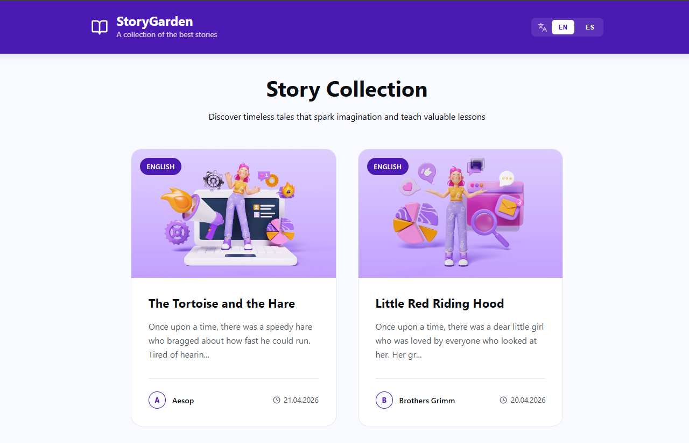

# Story Garden | Multi-Lang Story Hub

https://skycastx.netlify.app/

A modern, responsive, and multilingual story-sharing platform built with `React`, `React Router` and `Supabase`. This project features a clean UI and a robust cloud-based backend for content management.

## Technical Highlights:

- **Multilingual Support:** Toggle between English and Spanish seamlessly using React Context API.
- **Dynamic Routing:** SEO-friendly URLs using slugs instead of IDs (e.g., `/story/my-adventure`).
- **Cloud Database:** Real-time data fetching from Supabase PostgreSQL.
- **Cloud Storage:** Images hosted on Supabase Storage for high performance.
- **Professional UI:** Fully responsive design for mobile and desktop.
- **Stable Navigation:** Scroll-to-top functionality on page changes.

## Built With:

- React, React Router, Supabase, Custom CSS (BEM Architecture)
